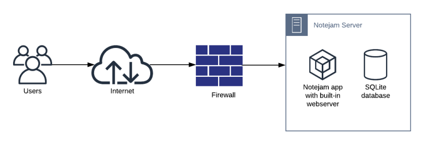
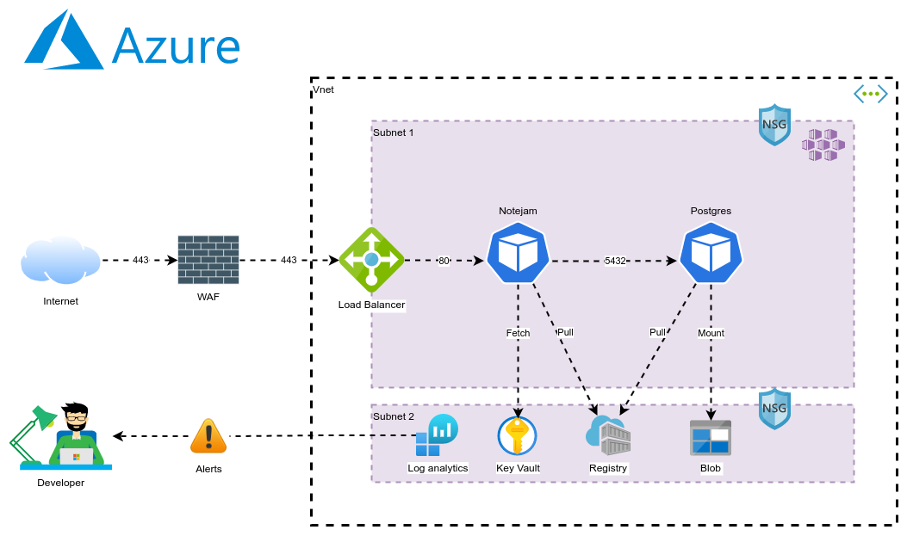
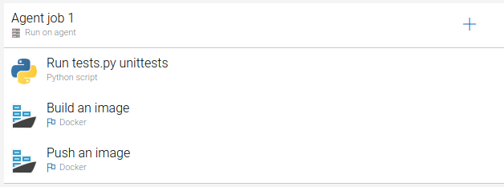
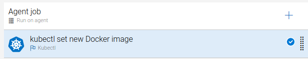

# https://www.notejam.ga
Notejam is a web application which allows users to sign up/in/out and create/view/edit/delete notes. 

## Context
The customer recognizes that the current Notejam architecture is insufficient for satisfying business requirements. The goal of this project is to present a viable solution to the constraints and limitations of the current architecture which will allow the customer to overcome them and meet business requirements. The new design presented in this project in conjunction with a proof-of-concept should motivate the client to adopt it.

## Business requirements
* The Application must serve variable amount of traffic. Most users are active during business hours. During big events and conferences the traffic could be 4 times more than typical.
* The Customer takes guarantee to preserve your notes up to 3 years and recover it if needed.
* The Customer ensures continuity in service in case of datacenter failures.
* The Service must be capable of being migrated to any regions supported by the cloud provider in case of emergency.
* The Customer is planning to have more than 100 developers to work in this project who want to roll out multiple deployments a day without interruption / downtime.
* The Customer wants to provision separated environments to support their development process for development, testing, production in the near future.
* The Customer wants to see relevant metrics and logs from the infrastructure for quality assurance and security purposes.

## Old architecture design
Notejam is currently built as an on-premise monolith which contains a built-in webserver and SQLite database. The design depicted in the image below is a typical situation in which a legacy system will find itself in.

Some major challenges to this design are:
1. Autonomy: on-premise situations typically have third-parties involved that each take part in management of the infrastructure. Lead-times for infrastructure changes or code releases are usually long and tedious. 
2. Scalability: on-premise designs do not easily allow for scaling up/down or auto-scaling. There exist some tools like Openstack that can mitigate this problem, but for Notejam this seems not to be the case.
3. Costs: typically the monthly infrastructure and overhead costs for on-premise designs are far higher than that of public cloud designs.
4. Resources: what we see often in legacy designs like Notejam is that a lot of resources (CPUs/memory) go to waste because these resources aren't shared across different environments or applications.
5. Disaster recovery: the current on-premise design does not easily allow for fail-over or any other disaster recovery procedure. If something bad happens to the datacenter the server is sitting in, or something happens to the server itself, precious data could be compromised or lost.
6. Complexity: currently Notejam is built as a monolith application, which means that all functionality is captured in one single application. The downside to monolith applications is that they are harder to maintain considering their complexity.

These are only a few of the challenges that came to mind. Overall, on premises designs are very rigid and can't keep up with the high pace at which the technology around it is changing and the pace at which its customers demand to be served.

## New architecture design
In this section I propose a first draft of the new architectural design that will satisfy all business requirements. I will add to the design choices that cover business requirements a set of design considerations, a backlog, that would further improve the architecture. I will give proper justifications for my choices and suggestions.

The diagram below depicts a first draft of the design and aims to show the most important components.

As you can see, the design looks a little more complex as compared to the old design. That's because the new design aims to take advantage of some very beneficial features the Cloud has to offer. 

Let's see how the new design satisfies our business requirements.
### The Application must serve variable amount of traffic. Most users are active during business hours. During big events and conferences the traffic could be 4 times more than typical
This requirement boils down to auto-scaling. Kubernetes is the perfect platform to allow for auto-scaling. Kubernetes scaling happens on two levels:
- Automatic scaling of the workload running on the cluster by means of [HPA](https://kubernetes.io/docs/tasks/run-application/horizontal-pod-autoscale/)
- Automatic scaling of underlying infrastructure by means of [cluster autoscaler](https://docs.microsoft.com/en-us/azure/aks/cluster-autoscaler)

The new design takes full advantage of Kubernetes' auto-scaling capabilities by allowing for scaling of underlying infrastructure (that is the nodes) and scaling of workload instances by means of HPA. The reason why you would want to employ these features is because they require no manual actions. You simply configure it once and the platform does the scaling by itself.
### The Customer takes guarantee to preserve your notes up to 3 years and recover it if needed
This requirement boils down to data retention and integrity. The way I suggest to do it is to store all data that you want to persist in Notejam.ga to an Azure storage. Kubernetes allows you to [mount Azure storage](https://kubernetes.io/docs/concepts/storage/volumes/#azurefile) volumes onto the workload. The Azure storage can then be configured by means of [life-cycle management](https://docs.microsoft.com/en-us/azure/storage/blobs/lifecycle-management-overview) to retain the data up to three years. The reason why you would want to go this route, is because you will take advantage of out-of-the-box Azure functionality to guarantee you data safety. It's simple, manageable and reliable.
### The Customer ensures continuity in service in case of datacenter failures
This requirement boils down to high-availability. The way the new design accounts for datacenter failures is by implementing three [availability zones](https://github.com/MicrosoftDocs/azure-docs/blob/master/articles/aks/availability-zones.md#overview-of-availability-zones-for-aks-clusters) for the Kubernetes cluster. In other words, when a datacenter becomes compromised in any way, the underlying infrastructure is distributed in such a way that it will keep running in other datacenters in the same region. The reason why you should use this is because Azure guarantees an [uptime SLA of %99.95 ](https://docs.microsoft.com/en-us/azure/aks/uptime-sla) for AKS clusters that employ availability zones.
### The Service must be capable of being migrated to any regions supported by the cloud provider in case of emergency
This requirement boils down to disaster recovery. In the unlikely case of a disaster, like an entire region becoming compromised, you would want to quickly and easily deploy the solution to a healthy region. The way I suggest to do that is by employing Infrastructure-as-Code with Terraform and Ansible. Infrastructure-as-Code defines the entire solution as code. The Terraform scripts that are provided in this repository will allow you to deploy identical infrastructure in a new region by changing only a single variable and then running the scripts by only a press-of-a-key. The Ansible scripts will configure the infrastructure and deploy a new Notejam.ga instance onto the cluster also by means of press-of-a-key. These tools are best integrated in a CI/CD pipeline for consistency and traceability. The ease, speed, traceability and consistency of managing your infrastructure as code is reason enough to want to adopt Infrastructure-as-Code.

As a side note I would like to mention that Azure also provides fail-over features on many of its products which could be seriously considered.
### The Customer is planning to have more than 100 developers to work in this project who want to roll out multiple deployments a day without interruption / downtime
This requirement boils down to CI/CD. What I suggest is to employ Azure DevOps as CI/CD platform that will allow many developers to collaborate and release changes many times throughout the day. Azure DevOps allows for implementing CI/CD pipelines that will automatically test, build and release your code onto your desired environment, which could be different namespaces on a single cluster or different clusters alltogether. The developers can simply queue up their code releases and any available Azure DevOps agents will pick up the job and perform the release automatically. What's nice about Azure DevOps is that it comes with many out-of-the-box plugins for developers wanting to build and release their code. It also allows for enforcing somewhat a standardized workflow for your developers. There's many other CI/CD platforms out there, but if you are already hosting in Azure it's perhaps best to stick with Azure DevOps since you will have vendor support, it's very easy to setup and manage and it integrates out-of-the-box with your Azure subscription. 

The image below depicts the build pipeline for Notejam.ga. The build pipeline first performs unittests to identify any code errors and will then build and push the new Docker image to a shared container registry that stores all artifacts.

The image below depicts the release pipeline for Notejam.ga. The release pipeline updates the Notejam.ga image tag to the new release tag.

To allow for zero-downtime deployments we will employ [Rolling Updates](https://kubernetes.io/docs/tutorials/kubernetes-basics/update/update-intro/) that will ensure the solution will stay available throughout the new release.

As a side note I would suggest to purchase enough Azure DevOps agents to accommodate for many developers collaborating and releasing changes. You ideally would want to always have an available agent to pick up the pending job.

### The Customer wants to provision separated environments to support their development process for development, testing, production in the near future
This requirement also boils down to CI/CD. You ideally want multiple environments that allow you to test your code changes before releasing them into live production. As I see it there are two options here:
1. Seperate all environments on the same cluster by means of [Kubernetes namespaces](https://kubernetes.io/docs/concepts/overview/working-with-objects/namespaces/)
2. Seperate environments by having multiple Kubernetes clusters.

The way I suggest is to have at least two Kubernetes clusters. You could have one cluster dedicated to non-production environments like DEV and TEST. Your other cluster could be dedicated to UAT and PROD environments. The reason why you would want multiple clusters is so your workload doesn't consume so  much resources on the single cluster and to test infrastructure changes first before persisting them to production. The reason why you would want UAT and PROD on the same cluster is to ensure the environments are identical as far as the infrastructure is concerned. 

Costs are also to be considered when making this design choice.

### The Customer wants to see relevant metrics and logs from the infrastructure for quality assurance and security purposes
This requirement boils down to monitoring and logging. The new design allows for monitoring and logging by employing the Azure Log Analytics Workspace, which acts as a central source for metrics and logs. The Log Analytics Workspace allows for creating highly customizable dashboards in which you can display many metrics in the form of charts or graphs. Log Analytics also allows to create alerts based on the metrics that are being collected. Another thing that's nice about the Log Analytics Workspace is that it is able to collect logs from many other resources except the infrastructure as well, such as the [Azure Activity Log](https://docs.microsoft.com/en-us/azure/azure-monitor/essentials/activity-log). This would allow for easy security audits.

As a side note I would like to mention that there's also many other monitoring and logging stacks available such as the Prometheus/Grafana stack. This stack is a little more user friendly.

## Backlog with additional design considerations
- Purchase paid Cloudflare license for WAF and CDN. Cloudflare is a platform that can help secure your solution endpoints by enforcing OWASP security rules and it helps speed up your solution by caching static content in its proxy servers around the world. At the moment the new design employs the Free tier license for Cloudflare as a proof-of-concept. (~1 sprint)
- Redesign current Notejam monolith in seperate Notejam and Database services. This is overall best-practice in Cloud native landscapes where you want to compartmentalize roles and responsibilities which will allow for easier management. You could also consider employing an Azure database-as-a-service. (~2 sprints)
- Introduce environment variables in Notejam.ga. This prevents hardcoding of sensitive data in the scripts. (~1 sprint)
- Introduce Azure Key Vault for secret and certificate management. Things like credentials or certificates are best stored in a Vault from which they can then be dynamically fetched by Kubernetes by means of the [Azure CSI-driver](https://docs.microsoft.com/en-us/azure/aks/csi-secrets-store-driver). (~1 sprint)
- Implement Dynamic Persistent Volumes with Azure storage Blob for database service. Since Kubernetes pods are ephemeral, you don't want to lose that data. Persistent Volumes account for persistency of the data in Azure storage. (~1 sprint)
- Introduce Geo-redundancy for data high-availability. To ensure the safety and availability of valuable data it is best-practice to have the data distributed over multiple regions. (~1 sprint)
- Implement infrastructure provisioning pipelines in Azure DevOps to account for disaster recovery scenarios. Deploy a new infrastructure by press-of-a-key. (~1 sprint)
- Implement alerts in Log Analytics Workspace to notify Operations on the health of Notejam.ga. (~1 sprint)
- Run Kubernetes CIS security benchmark to identify possible ways to harden the infrastructure and implement recommended security features. (~2 sprints)
- Implement RBAC in Kubernetes. (~1 sprint)
- Implement automatic node reboots with [KureD](https://github.com/weaveworks/kured) because Azure automatically patches the infrastructure but it doesn't reboot them. KureD can implement a custom schedule on which to reboot your patched infrastructure. (~1 sprint)
- Purchase and implement new TLS certificates issued by a more acknowledge authority to guarantee Notejam.ga visitors more safety. (~1 sprint)

## Proof-of-concept
Visit https://notejam.ga/ for a preview of Notejam running in Azure on Kubernetes!